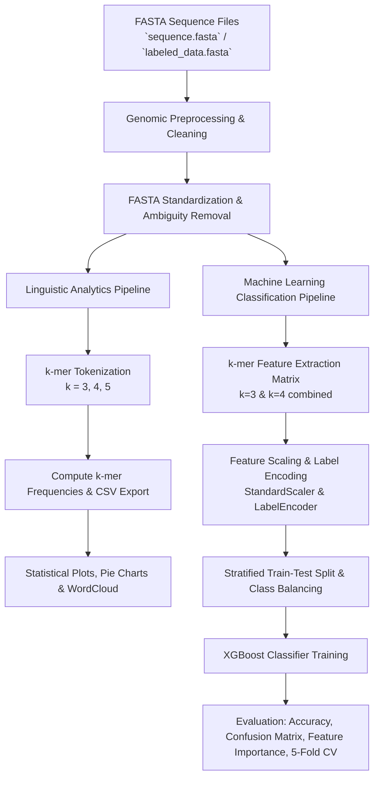

# 🧬 GENE-LANGUAGE-ANALYTICS

<div align="center">


<p align="center">
  <strong>Decoding the Language of Life using Natural Language Processing and Machine Learning</strong>
</p>

<p align="center">
  An end-to-end framework treating DNA/genomic sequences as biological text — extracting $k$-mer linguistic features, analyzing nucleotide composition and frequency distributions, and classifying Coding (Exons) vs. Non-Coding (Introns) regions with high precision.
</p>

</div>

---

## 📑 Table of Contents

- [📌 Overview](#-overview)
- [🔬 Biological Concept: DNA as a Language](#-biological-concept-dna-as-a-language)
- [⚙️ Pipeline & Architecture](#️-pipeline--architecture)
- [📊 Key Features & Analytics](#-key-features--analytics)
- [🤖 Machine Learning: Exon vs. Intron Classifier](#-machine-learning-exon-vs-intron-classifier)
- [📈 Experimental Results & Performance](#-experimental-results--performance)
- [📂 Repository Structure](#-repository-structure)
- [🚀 Getting Started](#-getting-started)
- [💻 Usage Guide](#-usage-guide)
- [🛠️ Tech Stack & Dependencies](#️-tech-stack--dependencies)
- [📜 License](#-license)

---

## 📌 Overview

**GENE-LANGUAGE-ANALYTICS** explores the intelligence of biological systems by modeling genetic sequences through the lens of **Natural Language Processing (NLP)**. Just as human language is composed of letters forming words and sentences with syntactic grammar, DNA sequences ($A, T, C, G$) encode structural instructions via codons and regulatory motifs.

This project implements:
1. **Genomic Preprocessing & Sequence Cleansing**: Processing large-scale FASTA files, stripping ambiguous nucleotides ($N$), and standardizing sequence line lengths.
2. **$k$-mer Frequency & Nucleotide Analytics**: Tokenizing genomic sequences into overlapping $k$-mers ($k=3$ codons, $k=4, 5$ motif sequences), computing relative frequencies, nucleotide proportions, and generating linguistic visualizations (WordClouds, distributions).
3. **Coding vs. Non-Coding Region Classification**: Feature vectorization using $k$-mer sliding windows ($k=3, 4$) combined with an **XGBoost Classifier** to accurately distinguish between **Exons (Coding)** and **Introns (Non-Coding)** sequences.

---

## 🔬 Biological Concept: DNA as a Language

| Natural Language Concept | Genomic Analog | Biological Significance |
|---|---|---|
| **Alphabet / Characters** | Nucleotide Bases ($A, C, G, T$) | Primary chemical building blocks of DNA |
| **Words / $n$-grams** | $k$-mers (e.g., $3$-mers / Codons) | 3-base combinations encoding 20 amino acids or regulatory signals |
| **Sentences / Paragraphs** | Genes & Chromosomes | Functional genetic units conveying biological instructions |
| **Grammar / Syntax** | Reading frames, Promoters, Splice sites | Structural constraints governing transcription & translation |
| **Functional / Structural Units** | Exons vs. Introns | **Exons**: Protein-coding regions (higher GC-bias)<br>**Introns**: Intervening non-coding sequences (AT-rich) |

---

## ⚙️ Pipeline & Architecture



---

## 📊 Key Features & Analytics

- **Automated FASTA Preprocessing**: Cleans multiline sequence headers, removes unassigned `N` bases, and formats lines uniformly.
- **$k$-mer Tokenization & Extraction**: Computes all permutations ($4^k$) of oligonucleotides using sliding windows with zero-division smoothing ($\epsilon = 10^{-6}$).
- **Base Composition Analysis**: Identifies base percentage distributions ($A, T, C, G$) to detect organismal GC/AT skew.
- **Rich Visualizations**:
  - **Top-$k$ Frequency Bar Charts**: Identifies the most prevalent codon combinations.
  - **Base Proportion Pie Charts**: Visualizes nucleotide balance.
  - **$k$-mer Word Cloud**: Graphical representation of the genomic lexicon.
  - **Model Interpretability**: Feature importance plots showing which $k$-mers most heavily influence exon vs. intron decisions.

---

## 🤖 Machine Learning: Exon vs. Intron Classifier

The classification module predicts whether a given sequence is **Coding (Exon)** or **Non-Coding (Intron)**.

### Methodology
1. **Dataset Handling**:
   - Supports genuine genome annotations or generates synthetic FASTA sequences with biological GC-bias ($\text{Exon GC} \approx 65\%$, $\text{Intron GC} \approx 35\%$).
2. **Feature Engineering**:
   - Extracts concatenated normalized frequency tables for $k=3$ (64 features) and $k=4$ (256 features), yielding **320 total genomic features per sequence**.
3. **Model & Training**:
   - **Classifier**: `XGBClassifier` (Gradient Boosted Trees)
   - **Optimization**: Regularized objective (`reg_lambda=1.5`, `max_depth=4`, `learning_rate=0.08`, `scale_pos_weight` for balanced learning).
   - **Validation**: 5-Fold Stratified Cross-Validation (`StratifiedKFold`).

---

## 📈 Experimental Results & Performance

| Metric | Value |
|---|---|
| **Test Accuracy** | **91.67%** |
| **5-Fold Cross-Validation** | **87.50% $\pm$ 11.18%** |
| **Coding (Exon) Precision / Recall** | Precision: **1.00** \| Recall: **0.83** \| F1: **0.91** |
| **Non-Coding (Intron) Precision / Recall** | Precision: **0.86** \| Recall: **1.00** \| F1: **0.92** |
| **Macro Average F1-Score** | **0.92** |

### Top Predictive $k$-mer Motifs
The model's feature importance analysis highlights GC-dense triplets (e.g., `CGC`, `GCC`, `CCG`) as key positive indicators for exons, while AT-rich motifs (e.g., `TTT`, `AAA`, `ATT`) strongly correlate with non-coding introns.

---

## 📂 Repository Structure

```plaintext
GENE-LANGUAGE-ANALYTICS/
│
├── gene language.ipynb             # Linguistic analysis, k-mer counts, plots & wordcloud
├── final code.ipynb                # End-to-end ML pipeline (XGBoost Exon vs. Intron classification)
├── sequence.fasta                  # Raw genomic FASTA dataset
├── clean_sequence.fasta            # Preprocessed, cleaned nucleotide sequence
├── labeled_dataa.fasta             # Labeled FASTA sequences (Exons & Introns)
├── kmer_frequencies.csv            # Computed 3-mer frequency distribution dataset
│
├── presentations (ppt)/            # Project presentation slide decks
│   ├── INTELLIGENCE OF BIOLOGICAL SYSTEMS(FINAL).pptx
│   ├── INTELLIGENCE OF BIOLOGICAL SYSTEMS.pptx
│   └── INTELLIGENCE OF BIOLOGICAL SYSTEMS[1].pptx
│
└── README.md                       # Project documentation
```

---

## 🚀 Getting Started

### Prerequisites

Ensure you have **Python 3.8+** installed along with `pip`.

### 1. Clone the Repository
```bash
git clone https://github.com/P-R-A-N-E-S-H/GENE-LANGUAGE-ANALYTICS.git
cd GENE-LANGUAGE-ANALYTICS
```

### 2. Create and Activate a Virtual Environment
```bash
# Windows
python -m venv venv
venv\Scripts\activate

# Linux / macOS
python3 -m venv venv
source venv/bin/activate
```

### 3. Install Dependencies
```bash
pip install numpy pandas scikit-learn xgboost matplotlib seaborn wordcloud biopython jupyter
```

---

## 💻 Usage Guide

### 1. Linguistic & Sequence Analytics
Launch Jupyter Notebook and open `gene language.ipynb`:
```bash
jupyter notebook "gene language.ipynb"
```
- Upload or point to `sequence.fasta`.
- Generates cleaned sequence `clean_sequence.fasta`.
- Computes $k$-mer counts exported to `kmer_frequencies.csv`.
- Renders nucleotide composition pie charts and $k$-mer WordClouds.

### 2. Exon–Intron ML Classification
Open and execute `final code.ipynb`:
```bash
jupyter notebook "final code.ipynb"
```
- Loads labeled exon and intron sequence data.
- Computes multi-scale $k$-mer matrices ($k=3, 4$).
- Trains the XGBoost model with cross-validation.
- Displays the **Confusion Matrix** and **Top 10 Most Influential $k$-mers** feature importance plot.

---

## 🛠️ Tech Stack & Dependencies

- **Language**: Python 3.8+
- **Machine Learning**: `xgboost`, `scikit-learn`
- **Data Manipulation**: `pandas`, `numpy`
- **Data Visualization**: `matplotlib`, `seaborn`, `wordcloud`
- **Genomic Processing**: Native FASTA parsing, `itertools`, `collections.Counter`
- **Notebook Environment**: `jupyter` / Google Colab

---

## 📜 License

This project is licensed under the [MIT License](LICENSE) — free to use for academic, research, and educational purposes.

---

<div align="center">
  <sub>Developed with ❤️ for Bioinformatics & Machine Learning research.</sub>
</div>
